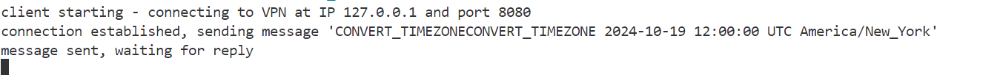
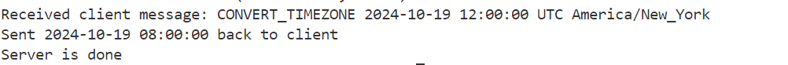
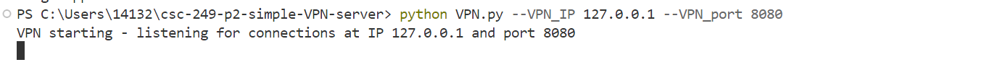
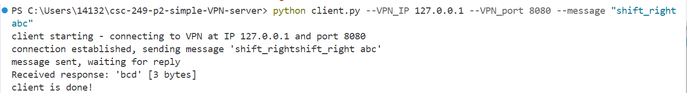
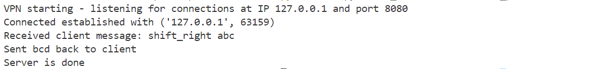

Name: Anh Tran
## Overview
This is a VPN client-server application that supports 2 operations:
- Shifting right: takes a string input and replace each character in this string with the next one in ASCII table. 
- Converting timezone: is used for converting time from one timezone to another one using pytz library from Python

## How to run and test the application
### Set up project environment 
- Clone the project repository
- Navigate to the project directory: cd csc-249-p2-simple-VPN-server
- Install dependencies: pip install -r requirements.txt

### Run the server
python3 VPN.py --VPN_IP 127.0.0.1 --VPN_port 8080

### Run the client
- Shift right: python3 client.py --VPN_IP 127.0.0.1 --VPN_port 8080 --message "shift_right <input_string>"
 - Example: python client.py --VPN_IP 127.0.0.1 --VPN_port 8080 --message "shift_right abc"
 - Expected output: 
    client starting - connecting to VPN at IP 127.0.0.1 and port 8080
    connection established, sending message 'shift_rightshift_right abc'
    message sent, waiting for reply
    Received response: 'bcd' [3 bytes]
    client is done!
- Convert timezone: python3 client.py --VPN_IP 127.0.0.1 --VPN_port 8080 --message "CONVERT_TIMEZONE <date> <time> <from_timezone> <to_timezone>"
 - Example: python3 client.py --VPN_IP 127.0.0.1 --VPN_port 8080 --message "CONVERT_TIMEZONE 2024-10-19 12:00:00 UTC America/New_York"
 - Expected output:
    client starting - connecting to VPN at IP 127.0.0.1 and port 8080 
    connection established, sending message 'CONVERT_TIMEZONECONVERT_TIMEZONE 2024-10-19 12:00:00 UTC America/New_York'   
    message sent, waiting for reply
    Received response: '2024-10-19 08:00:00' [19 bytes]
    client is done!

### Command-line trace
#### Convert time zone
- Start the server
  
- Start the client:

- Server output:

- Client output:

<h4> Shifting right </h4>
- Start the server
  
- Start the client:

- Server output:

- Client output:

If you have any issues when running application, please contact me via tran36a@mtholyoke.edu.
